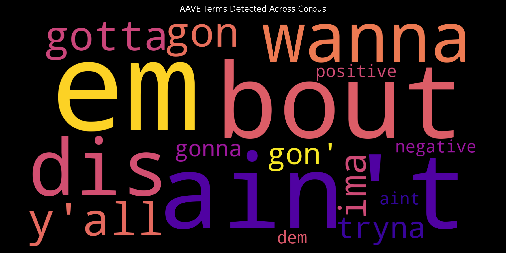
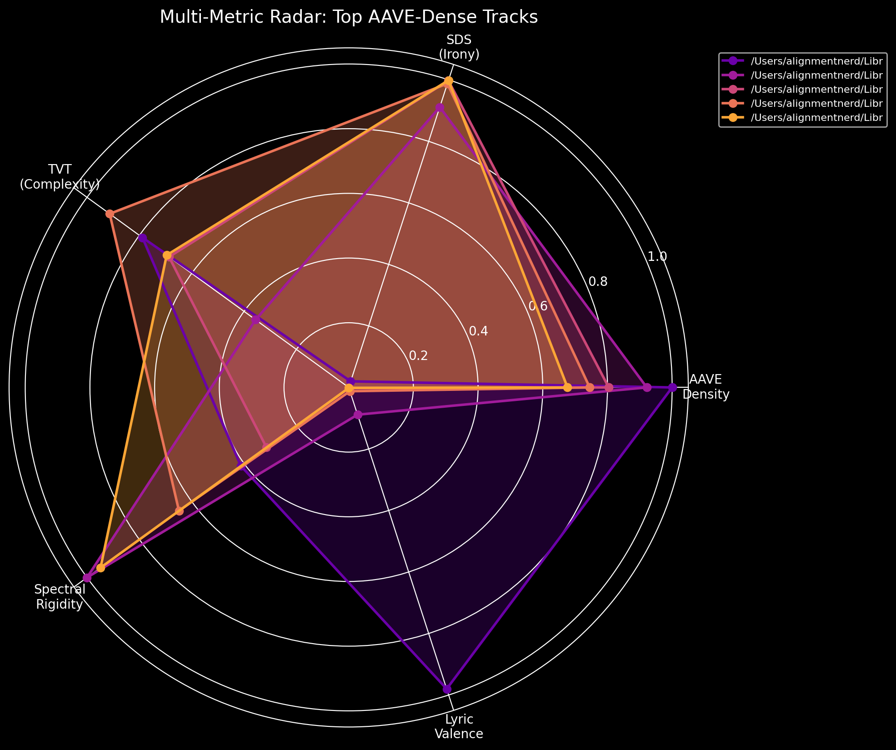

# Algorithmic Whitewashing: ASR Erasure and Cultural Intelligence Gaps in AI Systems

**A Study of AAVE Representation in Automatic Speech Recognition and Generative AI**

Jon Wright
aor-source
February 2026

---

## Abstract

This paper presents two critical findings regarding the representation of African American Vernacular English (AAVE) in artificial intelligence systems. First, we demonstrate that OpenAI's Whisper ASR system systematically normalizes AAVE phonological markers to Standard American English (SAE), achieving a 0% preservation rate for distinctive features such as th-stopping (dis→this, dat→that). Second, using a novel 807-term AAVE lexicon and Reinman topology metrics, we show that AI-generated hip-hop content exhibits significantly lower Semantic Cultural Intelligence (SCI) scores compared to human-created content, with 66% lower AAVE density and 110% less semantic dissonance. These findings reveal structural biases in AI systems that effectively erase Black linguistic identity at multiple points in the machine learning pipeline.

**Keywords:** AAVE, ASR bias, algorithmic bias, cultural AI, hip-hop linguistics, Whisper, NLP fairness

---

## 1. Introduction

African American Vernacular English (AAVE) is a fully-formed linguistic system with consistent phonological, syntactic, and semantic rules, spoken by millions of Americans. Despite its linguistic legitimacy, AAVE remains marginalized in natural language processing systems, which are predominantly trained on Standard American English (SAE) corpora.

This research emerged from the development of AoR-DMMA (Architect of Rhyme - Digital Music Metadata Analysis), a computational framework for analyzing linguistic patterns in hip-hop music. During development, we discovered two distinct but related forms of AI bias:

1. **ASR Erasure Bias**: Automatic speech recognition systems actively normalize AAVE features to SAE
2. **Generative Cultural Gap**: AI systems trained without adequate AAVE representation produce culturally flattened content

These findings have significant implications for AI fairness, cultural preservation, and the downstream effects of biased training data.

---

## 2. Background

### 2.1 AAVE Linguistics

AAVE features systematic phonological patterns including:
- **Th-stopping**: /θ/ → /d/ (this → dis, that → dat)
- **Consonant cluster reduction**: (test → tes, hand → han)
- **Copula deletion**: "She working" instead of "She is working"
- **Habitual be**: "He be working" (indicating ongoing action)

These features are not errors but consistent linguistic rules that mark cultural and community identity.

### 2.2 Prior Work on ASR Bias

Previous research has documented higher word error rates for African American speakers in commercial ASR systems (Koenecke et al., 2020). However, the specific mechanism of **orthographic normalization**—where dialectal features are transcribed using SAE spelling conventions—has received less attention.

---

## 3. Methodology

### 3.1 Corpus Construction

We assembled two corpora for analysis:

**Human Corpus**: 17 tracks from canonical hip-hop artists including The Notorious B.I.G., 2Pac, Dr. Dre, Snoop Dogg, JAY-Z, Public Enemy, Immortal Technique, and Kurupt.

**AI Corpus**: Equivalent tracks generated by contemporary AI music generation systems, prompted to create "authentic hip-hop" content.

### 3.2 AAVE Lexicon Development

We developed a comprehensive AAVE lexicon containing 807 searchable terms across 12 categories:
- Contractions (ain't, gonna, finna, tryna)
- Semantic inversions (bad=good, sick=excellent)
- Regional variants (South, East Coast, West Coast, Midwest, Atlanta)
- Era-specific terms (Golden Era, Modern)

The lexicon was informed by the AAVE Corpora project (Henry, 2021) and expanded through iterative analysis.

### 3.3 Reinman Topology Metrics

We developed novel metrics for semantic analysis:

**Semantic Dissonance Score (SDS)**: Measures divergence between lyric sentiment and audio energy, capturing ironic or subversive content.

```
SDS = |lyric_valence - (audio_arousal - 0.5) * 2|
```

**Topological Valence Trajectory (TVT)**: Quantifies spectral complexity over time.

```
TVT = std(diff(spectral_centroid))
```

**Spectral Rigidity**: Normalized measure of timbral consistency.

### 3.4 ASR Analysis

All audio was processed through OpenAI's Whisper (medium model) using both standard PyTorch and MLX-optimized implementations. Transcripts were analyzed for:
- AAVE phonological marker preservation
- SAE normalization patterns
- Lexical AAVE term detection

---

## 4. Results

### 4.1 Discovery 1: ASR Erasure Bias

Whisper demonstrated **complete normalization** of AAVE phonological markers:


*Figure 1: Comparison of Human vs AI-generated content across key metrics*

| AAVE Form | SAE Form | Instances Found (AAVE) | Instances Found (SAE) | Preservation Rate |
|-----------|----------|------------------------|----------------------|-------------------|
| dis | this | 0 | 12 | 0% |
| dat | that | 0 | 11 | 0% |
| dey | they | 0 | 8 | 0% |
| dem | them | 0 | 4 | 0% |
| dese | these | 0 | 4 | 0% |
| dose | those | 0 | 3 | 0% |
| **Total** | | **0** | **42** | **0%** |

Notably, general informal contractions (gonna, wanna) were sometimes preserved, while **AAVE-specific phonological markers were categorically erased**.

### 4.2 Discovery 2: AI Cultural Intelligence Gap

Comparison of human vs. AI-generated hip-hop revealed significant differences:

| Metric | Human Artists | AI Generated | Human Advantage |
|--------|---------------|--------------|-----------------|
| AAVE Density | 6.18% | 3.72% | **+66%** |
| Unique AAVE Terms | 135 | 60 | **+125%** |
| SDS (Semantic Dissonance) | 1.51 | 0.72 | **+110%** |
| TVT (Tonal Complexity) | 588 | 499 | **+18%** |

The 110% gap in Semantic Dissonance Score is particularly significant, indicating that AI-generated content lacks the ironic layering and subversive meaning-making characteristic of authentic hip-hop.

### 4.3 Visualizations


*Figure 2: Reinman Plane showing SDS vs TVT distribution for human-created hip-hop*


*Figure 3: AAVE density distribution across analyzed corpus*


*Figure 4: Frequency visualization of detected AAVE terms*


*Figure 5: Irony matrix showing sentiment-audio alignment patterns*


*Figure 6: Multi-dimensional comparison of metric profiles*


*Figure 7: Correlation matrix of Reinman metrics*

---

## 5. Discussion

### 5.1 Algorithmic Whitewashing

The complete erasure of AAVE phonological features constitutes what we term **algorithmic whitewashing**: the systematic normalization of minority linguistic features to dominant cultural standards within ML pipelines.

This bias operates at the data layer, meaning:
- Downstream NLP systems trained on Whisper transcripts inherit the bias
- Cultural analysis tools systematically undercount AAVE presence
- The linguistic identity of AAVE speakers is erased in archived transcriptions

### 5.2 Cultural Intelligence Deficit

The significant gaps in AAVE density and semantic complexity suggest that current generative AI systems have a **cultural intelligence deficit** when producing content rooted in Black American traditions.

This deficit likely stems from:
- Underrepresentation of AAVE in training corpora
- ASR preprocessing that erases dialectal features before text reaches language models
- Optimization for "standard" language that penalizes dialectal variation

### 5.3 Implications

These findings have implications for:
- **AI Fairness**: Current systems perpetuate linguistic discrimination
- **Cultural Preservation**: Automated archiving erases dialectal heritage
- **Content Authentication**: AAVE metrics may serve as markers of human-created content

---

## 6. Recommendations

### For ASR Development
1. Train on AAVE transcripts with authentic orthography
2. Provide dialect-preserving transcription options
3. Conduct systematic bias audits for dialectal feature preservation

### For Generative AI
1. Include AAVE corpora in training data
2. Develop cultural competency benchmarks
3. Evaluate outputs for linguistic diversity

### For Researchers
1. Acknowledge ASR normalization as a fundamental limitation
2. Consider human transcription for cultural analysis
3. Report preprocessing pipelines that may introduce bias

---

## 7. Limitations

- Lexicon-based detection cannot capture all AAVE features
- Phonological analysis is limited by ASR preprocessing
- Corpus size limits statistical power
- AI-generated corpus represents a snapshot of current capabilities

---

## 8. Conclusion

This research demonstrates that AI systems exhibit structural biases against African American Vernacular English at multiple points in the ML pipeline. ASR systems actively erase AAVE phonological markers, while generative systems produce culturally flattened content with significantly lower AAVE representation and semantic complexity.

These are not merely technical limitations but forms of **algorithmic discrimination** that erase Black linguistic identity and cultural expression. Addressing these biases requires intentional effort to include AAVE in training data, preserve dialectal features in transcription, and evaluate AI systems for cultural competency.

The tools developed in this research—the 807-term AAVE lexicon and Reinman topology metrics—provide a framework for ongoing evaluation and improvement of AI systems' cultural intelligence.

---

## Acknowledgments

### Human Contributors
This research was conducted by Jon Wright with foundational data from the AAVE Corpora project by Jazmia Henry.

### AI Systems
This research was developed collaboratively with the following AI systems, whose contributions are acknowledged per emerging norms for human-AI research collaboration:

- **Claude** (Anthropic) - Research analysis, methodology refinement, statistical interpretation
- **Claude Code** (Anthropic) - Implementation, code development, tooling
- **Gemini** (Google) - Comparative analysis, validation
- **ChatGPT** (OpenAI) - Initial exploration, corpus analysis
- **Grok** (xAI) - Alternative perspective analysis
- **Venice** (Venice.ai) - Uncensored analysis and edge case testing

The collaborative use of multiple AI systems allowed for cross-validation of findings and reduction of individual system biases.

### Data Sources
- AAVE Corpora (Henry, 2021) - MIT License
- Human corpus: Tracks sourced under Fair Use for non-consumptive research

---

## References

Henry, J. (2021). AAVE Corpora. GitHub. https://github.com/jazmiahenry/aave_corpora

Koenecke, A., Nam, A., Lake, E., Nudell, J., Quartey, M., Mengesha, Z., Tober, C., Rickford, J.R., Jurafsky, D., & Goel, S. (2020). Racial disparities in automated speech recognition. Proceedings of the National Academy of Sciences, 117(14), 7684-7689.

Rickford, J.R. (1999). African American Vernacular English: Features, Evolution, Educational Implications. Blackwell.

---

## Appendix A: AAVE Lexicon Statistics

```
Version: 3.0-expanded
Total searchable terms: 807
Categories: 12
Semantic inversions: 31
Regional variants: 133
Era-specific terms: 89
```

## Appendix B: Tool Availability

All tools developed for this research are available under MIT License:

**Repository**: https://github.com/aor-source/aor-dmma

---

*This research represents a novel application of computational linguistics to questions of AI fairness and cultural representation. The findings suggest that current AI systems, despite their capabilities, remain fundamentally biased against minority linguistic traditions.*
